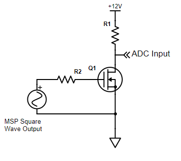
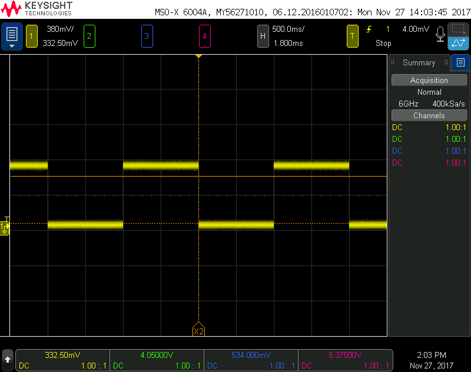
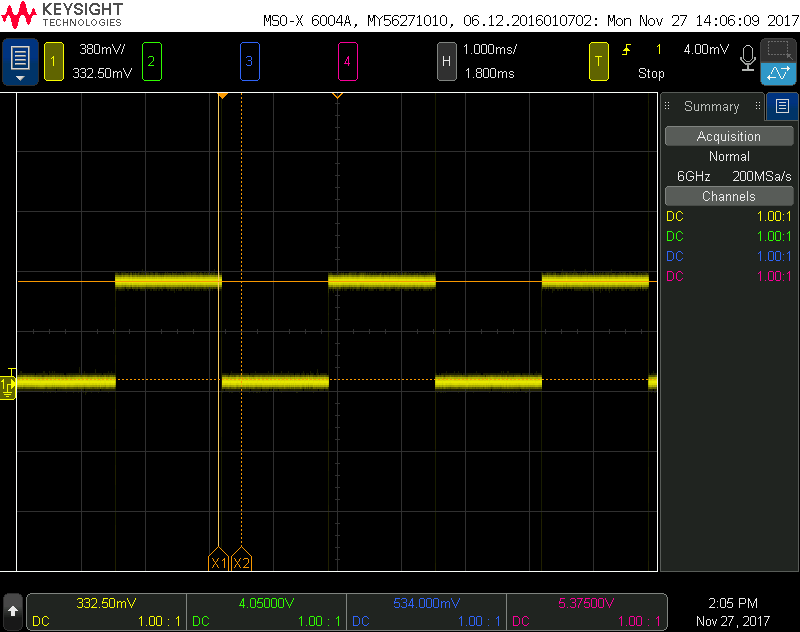
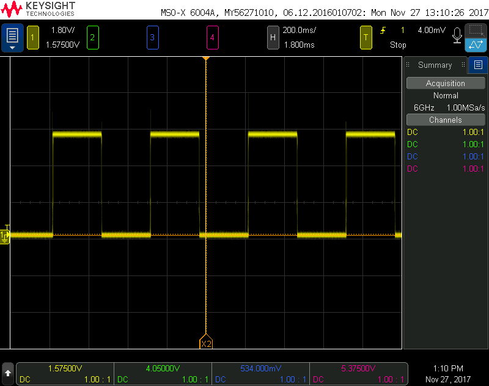
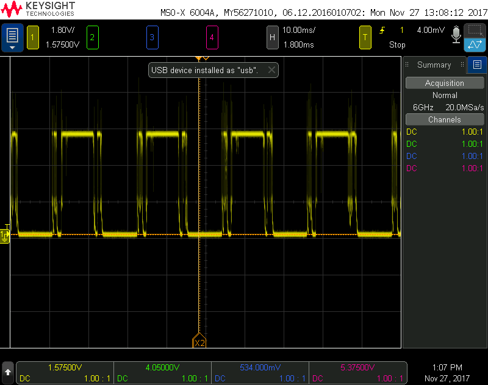

High Power Readme
Authors: Ben Jukus and Ryan Drexel

# Power Resistor
The power resistor used in this section of the lab is the same as the power resistor in the Open Loop Systems portion of the lab, which is a 80 Ohm power resistor. A 2 Watt 100 Ohm resistor would have worked just as well since the absolute maximum power disappated across the resistor would be 1.44 Watts; 1.44 Watts would be in the case of a short. The 5 Watt resistor was chosen instead due to availability. 
In the MOSFET circuit the voltage across the power resistor is 11.5 V, so 144 mA are going through the resistor, a power disappation of 1.65 Watts. 

# Square Wave
The square wave produced by the G2553 is essentially the same as the timer A blink done in lab 3. By varying the toggle speed of the input to the MOSFET the switching speed of the MOSFET and the relay can be found. To vary the toggle speed of the input the TACCR0 value can be easily changed in the code and re-debugging. 
This process is essentially the same as debouncing the switch. In the switches' case it was a mechanical failure of the contact hitting, whereas the phsyical properties of the silicon in the MOSFET, the resistance between the drain and source and the parasitic capacitance of the MOSFET itself, limit the speed at which the MOSFET can switch. 

# MOSFET Switching
The schematic for a simple mosfet switch can be seen in the following diagram. In this a load resistor is connected to the 12 volt source and the gate of the MOSFET is connected to the square wave output of the microcontroller. 
 
The switch flipping at 0.5 Hz can be seen next, the switch behaves as expected and continues to do so at 300 Hz and likely 
 
The MOSFET can be seen still flipping relatively accurately with minor weird spikes on the edges of the signal. 
 

# Relay Switching 
The schematic for the relay switch circuit can be seen in this next figure. In this the MOSFET is not acting as a switch, but it is instead used as a buffer to isolate the microcontroller from the relay. The MOSFET protects the G2553's pin from the relay as it may draw too much current and burn out the pin. The diode in the schematic is there to protect the MOSFET from reverse voltage caused by the emf produced by inductor in the relay.
 
The MAD-S-112-C relay which is an automotive relay was used due to its availability. 
A picture of the physical circuit can be seen next. 
 
The relay can be seen on the oscilloscope with a 2 Hz square wave going into it below. 
 
The relay switch is only capable of switching at approximately 46 Hz, any higher and the relay will stop making full contact with the LED. This can be seen in the following figure. 
 

# References
http://www.electronics-tutorials.ws/transistor/tran_7.html
http://www.electronics-tutorials.ws/blog/relay-switch-circuit.html

