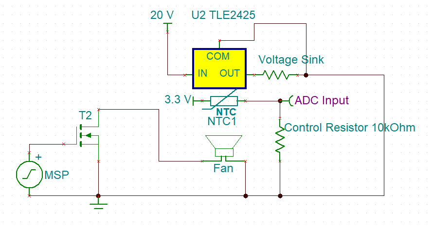

Open Loop System Readme

Author: Ben Jukus

# Circuit
 

## Temperature Sensor
The LM35 was used as our temperature sensor. This device is outputs a voltage proportional to the temperature surrounding the device, this proportion is 0.01*Temperature in Celsius. The LM35 is its own built-in circuit that figures this conversion which is then output to the "Common" pin which is then read into our ADC input. 

## 5 Volt Regulator
The 5 volt regulator is used simply to heat up the LM35. The rate at which the regulator heats up is dependent upon the voltage and the resistance across it. To adjust this easily the voltage can be changed on the power supply and the resistance connected from 5 V to ground change be changed. A happy medium heating rate was found experimentally using a 10 Ohm, 2.5 Watt power resistor and adjusting the voltage so that the rate of the temperature increase was not greater than the cooling rate of the fan at 100% duty cycle. The voltage found to be able heat up to 65 C and cool down to 40 C without needing the fan at maximum speed 10.5 V. 

## MSP430
The board chosen was based on the number of timers it had. The MSP430FR5994 was used as it has two main timers, A and B, with additional A.x timers. Timer A.0 and B.0 were used in Open Loop control. Timer A.0 was used to control the UART Transmission and to Enable the ADC and Start its conversion. Timer B.0 was used simply as a PWM to control the duty cycle of the fan. TBCCR2, which is output to pin 1.5, was changed directly to modify the duty cycle of the fan. 

# Fan Control
In order to control the fan the MSP430 needed to output a PWM but the fan could not be powered by the fan as it would need too much current to function and would blow out the output pin it was connected to. A MOSFET switch was used to isolate the fan from the MSP430. By powering the fan with 12 V and connecting its ground terminal to the drain of the switch. The gate of the switch was connected to the output PWM pin and the source was connected to ground; in this configuration the fan has power going to it at all times, but the potential across it is controlled by the PWM which flips the switch.  

# BOM
5V Regulator 		LM317T 

Temperature Sensor	LM35

MOSFET(NMOS)		2N7000

Fan (12V, 0.75 A)

# References
http://www.ti.com/lit/ds/symlink/lm35.pdf
