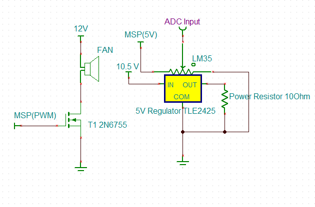

Open Loop System Readme
Author: Ben Jukus

# Circuit
 

## Temperature Sensor

## 5 Volt Regulator

## MSP430
Since the rest of Lab 6 relied on the MSP430G2553 it will continue to be used here. The ADC in this processor is only 10 bits; however, the accuracy of a 12 bit ADC does not seem necessary. While the 12 bit ADC is 4 times as accurate as the 10 bit ADC in this application all of the devices used are simply not nearly sensitive enough for it to make much of a difference. Additionally the G2553 chip can be more easily replaced than the chips of the other boards. 
# Fan Control

BOM:
5V Regulator 		LM317T
MOSFET(NMOS)		2N7000
Fan (5V, 0.15 A)	Qualtek FAD1-06025BBLW12